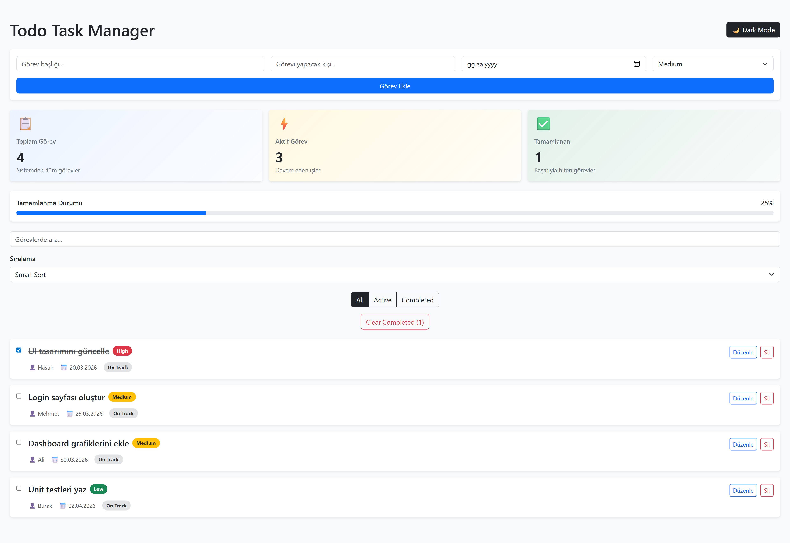
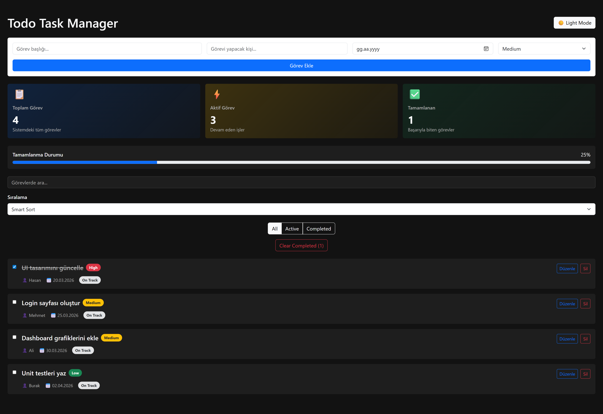

# 🚀 Todo Task Manager Dashboard

Modern task management dashboard built with React + TypeScript featuring smart sorting, priority system, deadline tracking and dark mode.

## 🚀 Özellikler

- Görev ekleme
- Görev düzenleme
- Görev silme
- Görev tamamlama
- Görev arama
- Filtreleme (All / Active / Completed)
- Akıllı sıralama (Smart Sort)
- Priority sistemi (High / Medium / Low)
- Deadline yönetimi
- Atanan kişi bilgisi
- Dashboard istatistikleri
- Progress bar
- Dark Mode
- Responsive tasarım

## 🧠 Smart Sorting

Görevler otomatik olarak şu kurala göre sıralanır:

1. Overdue
2. Today
3. Soon
4. On Track

Aynı grupta:

- High priority
- Medium priority
- Low priority

## 🛠️ Kullanılan Teknolojiler

- React
- TypeScript
- Bootstrap
- CSS
- LocalStorage

## 📸 Screenshots

### Light Mode

### Dark Mode

## 👨‍💻 Developer

Hasan Cebrail Törer

GitHub  
https://github.com/HCTORER

LinkedIn  
https://www.linkedin.com/in/hasan-cebrail-t%C3%B6rer-4218123b2/
